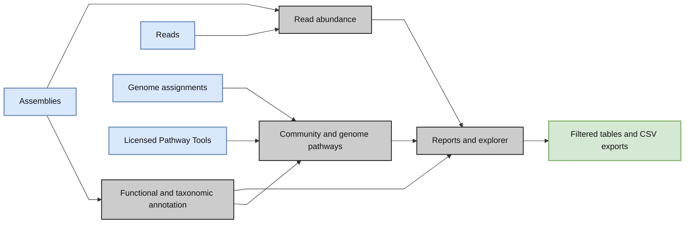

# MetaPathways

## Abstract

The development of high-throughput sequencing technologies over the past decade has generated a tidal wave of environmental sequence information from a variety of natural and human engineered ecosystems. The resulting flood of information into public databases and archived sequencing projects has exponentially expanded computational resource requirements rendering most local homology-based search methods inefficient. MetaPathways v1.0 is a modular annotation and analysis pipeline for constructing environmental Pathway/Genome Databases (ePGDBs) from environmental sequence information capable of using the Sun Grid engine for external resource partitioning. However, a command-line interface and facile task management introduced user activation barriers with concomitant decrease in fault tolerance.

MetaPathways has since advanced as a modular tool, deepening our understanding of microbial metabolism at various biological levels. With this release, we have addressed previous challenges in modularity and database management. v3.5 enhances user accessibility through streamlined installation via package indexes or containers, refined modules, and interface upgrades. It boasts updated algorithm support for sequence feature prediction, annotation, metabolic inference, and coverage metrics. Tested on mock community data, Metapathways v3.5 demonstrates improved performance and usability. With automated installation and database management, this open-source tool makes advanced metagenomic analysis more accessible. Metapathways v3.5 represents a significant step forward in automated, comprehensive metagenomic analysis, facilitating a deeper exploration of microbial interactions and metabolic functions in environmental genomics.

## Workflow

[](docs/assets/workflow.svg)

Assemblies and references drive annotation; optional reads add abundance, and contig-to-genome maps enable genome-specific analysis. PGDB inference requires licensed Pathway Tools. The final report and explorer connect available results for searching, subsetting and CSV export. Numbered modules summarize the biology; see the [detailed workflow](https://metapathways.readthedocs.io/en/latest/detailed-workflow.html) for task dependencies and citations.

## Quick start

Install MetaPathways, try the included three-sample dataset, then use your own data. Linux x86-64 is supported. Choose one installation method below; **Mamba is recommended**.

### 1. Conda package with Mamba (preferred)

```bash
mamba create -n metapathways --override-channels --strict-channel-priority \
  -c hallamlab -c conda-forge -c bioconda metapathways=3.5.2
conda activate metapathways
```

This installs MP and its workflow dependencies, including MAGSplitter and Camelot. Prepare the included data, build the small reference database, and run all three samples:

```bash
metapathways prepare_test -o ~/mp-reviewer
cd ~/mp-reviewer
metapathways build_db --test -d MPDB
metapathways analysis_wf \
  --manifest cami-reviewer/all.tsv -o all -d MPDB \
  --annotation_dbs swissprot_test \
  --rRNA_refdbs SILVA_SSU_test SILVA_LSU_test \
  --skip_ptools --threads 4 --memory '4 GB' --max_tasks 2
metapathways report -o all --serve --no-browser --port 8765
```

Open the URL printed by the report server. On a remote server, use an [SSH tunnel](https://metapathways.readthedocs.io/en/latest/reports-tutorial.html#view-a-remote-report-through-ssh). The **2.4 MiB input dataset is included** in the package and is derived from CAMI II ([Meyer et al., 2022](#cami-references)); database preparation downloads enzyme and taxonomy support records. The test covers annotation, paired-read abundance, genome splitting, reports and exploration. Pathway inference is skipped because it requires your own Pathway Tools license.

### 2. Quay: Docker or Apptainer

```bash
# Docker
docker pull quay.io/hallamlab/metapathways:3.5.2

# Or Apptainer
apptainer pull metapathways.sif docker://quay.io/hallamlab/metapathways:3.5.2
```

The image includes the same workflow dependencies and reviewer data. Follow the [Docker three-sample test](https://metapathways.readthedocs.io/en/latest/containers.html#docker-three-sample-test) or [Apptainer three-sample test](https://metapathways.readthedocs.io/en/latest/containers.html#apptainer-three-sample-test) to run the commands with your working directory mounted for persistent results. Licensed Pathway Tools is a separate image.

### 3. Local installation from GitHub

```bash
git clone https://github.com/hallamlab/MetaPathways.git
cd MetaPathways
mamba env create -f docker/conda_base.yml
conda activate metapathways
mamba install --yes -c conda-forge pip
python -m pip install .
```

Then run the **same three-sample commands under option 1**, starting with `metapathways prepare_test -o ~/mp-reviewer`. MP installs its Python workflow helpers automatically. The data comes from the installed package; the test does not depend on your checkout location.

### Try your own data

Build a production reference database, then annotate an assembly:

```bash
metapathways build_db -d ~/MPDB --func swissprot -a fast
metapathways run -i /path/to/assembly.fasta -o results -d ~/MPDB --threads 8
```

For assemblies with reads and genome maps, follow the [complete workflow](https://metapathways.readthedocs.io/en/latest/inputs.html). **If you want PGDBs, complete the [Pathway Tools installation guide](https://metapathways.readthedocs.io/en/latest/pathway-tools.html) before starting that workflow.** The small reviewer references are for testing only.

## Conceptual overview



## Full documentation

The complete guide is at **[metapathways.readthedocs.io](https://metapathways.readthedocs.io/)**. Documentation source stays in this repository under `docs/`.

- [Reviewer walkthrough](https://metapathways.readthedocs.io/en/latest/reviewer-test.html): expected results and single-/two-sample variants.
- [Complete workflow](https://metapathways.readthedocs.io/en/latest/analysis.html): inputs, manifests and end-to-end execution.
- [Pathway Tools setup](https://metapathways.readthedocs.io/en/latest/pathway-tools.html): obtain the installer and build your licensed image **before running PGDB inference**.
- [Local resources and Slurm](https://metapathways.readthedocs.io/en/latest/resources.html): threads, memory and cluster submission.
- [Reports and exploration](https://metapathways.readthedocs.io/en/latest/reports-tutorial.html): browse results and export tables.
- [Detailed workflow and tool citations](https://metapathways.readthedocs.io/en/latest/detailed-workflow.html), with diagrams and a downloadable bibliography.
- [Architecture](https://metapathways.readthedocs.io/en/latest/architecture.html), [data flow](https://metapathways.readthedocs.io/en/latest/data-flow.html), and [CLI reference](https://metapathways.readthedocs.io/en/latest/cli-reference.html).

## Team, support and citation

Current team: Ryan J. McLaughlin, Tony X. Liu, Tomer Altman, Aditi N. Nallan, Aria S. Hahn, Julia Anstett, Connor Morgan-Lang, Kishori M. Konwar and Steven J. Hallam. Previous contributors include Niels W. Hanson and Shang-Ju Wu.

Source: [hallamlab/MetaPathways](https://github.com/hallamlab/MetaPathways). Historical code: [MetaPathways-legacy](https://github.com/hallamlab/MetaPathways-legacy). Questions and bug reports: [GitHub issues](https://github.com/hallamlab/MetaPathways/issues). License: [MIT](LICENSE), with bundled third-party license notices retained.

Please cite:

> McLaughlin RJ, Liu TX, Altman T, Nallan AN, Hahn AS, Anstett J, Morgan-Lang C, Konwar KM, Hallam SJ. *MetaPathways v3.5: Modularity and Scalability Improvements for Pathway Inference from Environmental Genomes*. bioRxiv (2024). [doi:10.1101/2024.06.04.597460](https://doi.org/10.1101/2024.06.04.597460).

## CAMI references

- **CAMI:** Sczyrba, A., Hofmann, P., Belmann, P., et al. (2017). *Critical Assessment of Metagenome Interpretation—a benchmark of metagenomics software*. **Nature Methods 14**(11), 1063–1071. [DOI: 10.1038/nmeth.4458](https://doi.org/10.1038/nmeth.4458). [CAMI project website](https://cami-challenge.org/).
- **CAMI II:** Meyer, F., Fritz, A., Deng, Z.-L., et al. (2022). *Critical Assessment of Metagenome Interpretation: the second round of challenges*. **Nature Methods 19**(4), 429–440. [DOI: 10.1038/s41592-022-01431-4](https://doi.org/10.1038/s41592-022-01431-4). [CAMI project website](https://cami-challenge.org/).
- **Source dataset for the MP reviewer subset:** CAMI II multi-sample human microbiome dataset. [Dataset DOI: 10.4126/FRL01-006425518](https://doi.org/10.4126/FRL01-006425518). The bundled inputs are selected and cropped subsets of this collection; their exact transformations and file hashes are recorded in the bundle provenance.
