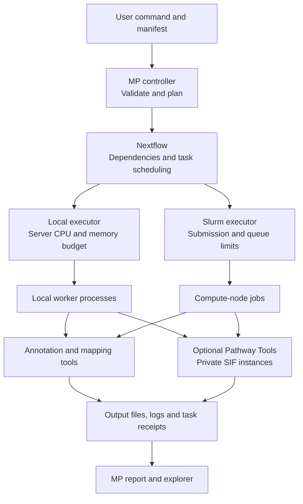

# Software architecture: local and HPC

For the tool-by-tool diagrams and citations, see the [detailed workflow](detailed-workflow.md).

The MP command validates inputs and creates a dependency graph. Nextflow schedules ready tasks using the selected executor; the biological tools perform the same work in either mode. The MP controller and Nextflow continue running until the workflow finishes.

The two executor branches are alternatives selected by `--executor`; local execution is the default. Workers need access to the software environment, inputs, reference databases, image and output paths. On Slurm these must be accessible from the compute nodes, usually through shared storage. This diagram shows logical components; shared boxes do not mean jobs share a Pathway Tools instance.

Thread-capable tools use the requested `--threads`; serial tools, including Pathway Tools, request one CPU. Nextflow can run independent tasks simultaneously. Local concurrency fits detected or specified CPU/memory budgets. Slurm requests resources per job, with `--max_tasks` and `--submit_rate` bounding submissions. See [resource settings](resources.md).

Each containerized PGDB attempt has private Pathway Tools state, allowing separate entities to run concurrently. A community PGDB failure fails the required workflow task; MAG failures are retained as optional outcomes. Reports include task statuses and diagnostics. See [execution and restart behavior](execution.md) and [Pathway Tools](pathway-tools.md).
