# Data flow: inputs to connected results

For the tool-by-tool diagrams and citations, see the [detailed workflow](detailed-workflow.md).

The arrows show which data products feed each calculation. They do not require independent branches to run serially. MP preserves sample, contig, feature and entity identifiers so the final tables can be joined and explored.

[Zoom diagram](assets/diagrams/data-flow.svg) · [Mermaid source](diagrams/data-flow.mmd)

- Without reads, MP does not compute read abundance.
- Without a genome map, community analysis can still proceed; genome splitting is omitted.
- With `--skip_ptools`, annotation, abundance and reports remain available, but PGDB inference is omitted.
- PGDB staging joins annotations back to actual contig sequences and feature coordinates. Both community and genome PGDBs need sequence-backed inputs.

Abundance is calculated from the reads and features, independently of pathway inference. A pathway–gene association can be joined to abundance through the corresponding feature IDs; these are different measurements, not interchangeable values. Each annotation's taxonomy belongs to that annotation's reference database. See the [result schema](results-schema.md) for table keys and safe joins.

Follow the [complete workflow](analysis.md) for commands, or the [stage reference](workflow.md) for individual products and dependencies.
