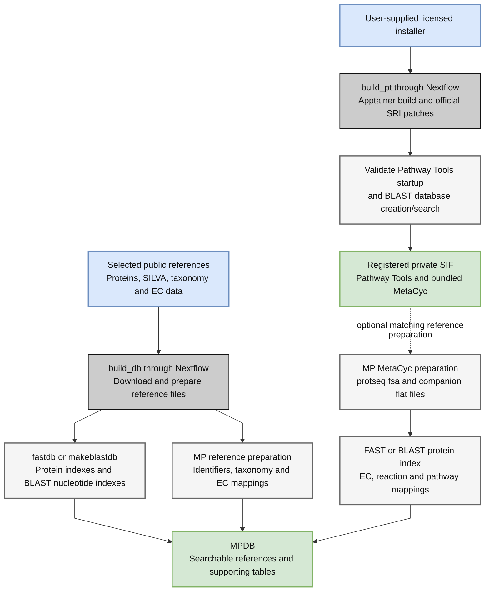
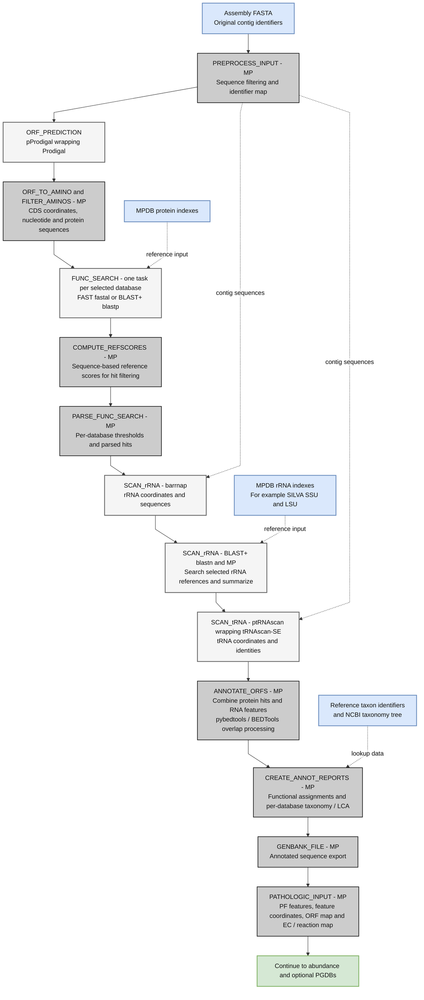
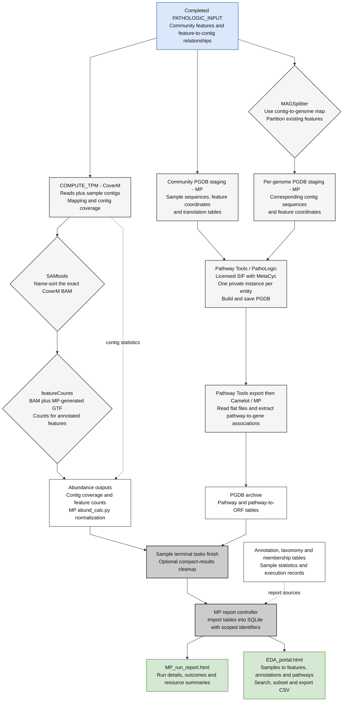

# Detailed workflow and tool citations

This page follows a nucleotide assembly through MetaPathways, from reference preparation to connected annotation, abundance and pathway tables. It identifies the software responsible for each calculation and explains how Nextflow schedules it. For a shorter introduction, see the [conceptual overview](overview.md), [local/HPC architecture](architecture.md) and [data-flow overview](data-flow.md).

**If you want pathway/genome databases (PGDBs), complete the [Pathway Tools installation guide](pathway-tools.md) first.** Annotation, read abundance and reporting can run with `--skip_ptools`.

## How to cite your analysis

Cite [MetaPathways](#metapathways), [Nextflow](#nextflow), the biological tools used by your selected stages, and the reference databases you searched. Add [Pathway Tools](#pathway-tools), [MetaCyc](#metacyc), MAGSplitter and Camelot when those components are used. Cite the container runtime and Slurm when applicable. The tables below connect each component to its publication or official project; the [full references](#full-references) include DOI links and websites.

Download {download}`the software and database bibliography <assets/workflow-tools.bib>`. Papers describe methods, not the precise software or database versions in your run: also record the MP version, environment, reference releases, image identity, settings and execution logs. See [reproducibility](reproducibility.md). For the bundled reviewer data, use the separate [CAMI and CAMI II citations](cami-references.md).

## 1. Prepare references and the optional Pathway Tools image

These are setup commands, run before sample analysis. An existing compatible MPDB and SIF can be reused across samples and computers; they are not rebuilt for each sample.

`build_db` prepares selected public references and the supporting MPDB structure. FAST uses `fastdb`; BLAST+ uses `makeblastdb`. rRNA searches require nucleotide BLAST indexes. MP's own preparation scripts build the lookup tables consumed by annotation and reporting. Database options and custom references are described in [database construction](databases.md).

`build_pt` builds and validates a private Apptainer image from the licensed installer. With its optional MPDB destination, MP extracts the matching MetaCyc protein FASTA **and companion flat files**, builds the selected search index, and derives the EC/reaction/pathway mappings. This licensed preparation is separate from the public-reference build. See [MetaCyc preparation](pgdb-workflow.md#metacyc-from-pathway-tools).

The BLAST+ installation inside the Pathway Tools image supports Pathway Tools' own sequence databases. It is distinct from the FAST/BLAST choice for MP's functional annotation searches. Docker is an alternative way to run the MP application image; it is not required to build the Pathway Tools SIF.

## 2. Plan and schedule work

`analysis_wf` validates the manifest or automatically matched input layout, resolves sample IDs, and builds a task dependency graph. The Python controller writes modular Nextflow definitions plus task specifications. Nextflow runs eligible tasks locally or submits them to Slurm; it does not submit every downstream task before its inputs are ready. See [input organization](inputs.md) and [execution](execution.md).

Each worker checks its task receipt and tracked inputs before either reusing valid outputs or invoking the recorded command. Tasks write biological outputs into the sample's output directory and retain command output, status and resource diagnostics. Nextflow's trace, report and timeline describe the invocation; MP's receipts also distinguish reused work and optional entity outcomes.

| Scheduling level | What can run together |
| --- | --- |
| Across samples | Ready stages from different samples can overlap. Samples are not processed one at a time. |
| Within an annotation stage | Independent searches or parses for different reference databases can overlap. The following stage waits for that group. |
| After Pathway Tools input preparation | Read abundance, the community PGDB, and MAG splitting can proceed independently. Each MAG PGDB waits for splitting. |
| Within a task | Capable tools receive the requested thread budget. pProdigal and ptRNAscan distribute work across their underlying predictors. Serial stages and each Pathway Tools task reserve one CPU. |
| Across executors | Local execution fits aggregate CPU/memory limits. Slurm uses per-job requests plus submission/queue limits; dependencies remain managed by Nextflow. |

`--threads` controls capable tools, not the total workflow concurrency. `--max_cpus`, `--max_memory`, `--max_tasks` and Slurm submission settings are explained in [resources](resources.md). Multiple processes shown inside one task, such as CoverM, SAMtools and featureCounts, run as subcommands of that task; they are not separate Slurm jobs.

## 3. Predict and annotate features

This diagram follows the **stage order for nucleotide FASTA input**. Boxes grouping multiple MP transformations are abbreviated for readability. The reference searches within a group can run concurrently; this does not imply that all RNA prediction and protein search stages run independently within a sample. Protein-only inputs follow the compatible reduced path described in the [stage reference](workflow.md).

pProdigal parallelizes [Prodigal](#prodigal) gene prediction. MP derives and filters protein sequences before searching the selected protein references with FAST or [BLAST+](#blast). MP computes sequence-based reference scores and then applies its configured search thresholds and score-ratio rules. FAST is a threaded implementation derived from [LAST](#last); citing FAST does not mean the separate LAST executable was run.

Barrnap predicts rRNA features; BLAST+ searches their sequences against the chosen rRNA references. ptRNAscan partitions the input and starts single-threaded [tRNAscan-SE](#trnascan-se) workers within the assigned CPU budget. Barrnap and tRNAscan-SE use their own underlying RNA search software/models, including [nhmmer/HMMER](#nhmmer--hmmer) and [Infernal](#infernal), respectively. These are not additional MP-level workflow stages.

MP combines protein and RNA evidence, performs feature-overlap processing through [pybedtools](#pybedtools)/[BEDTools](#bedtools), and writes annotation tables and annotated sequence products. An annotation row's taxonomy comes from **that row's reference database**. Hit taxonomy and the within-database lowest common ancestor (LCA) remain distinct; MP does not borrow a taxon assignment from another database to fill the row. References without supported taxonomy produce the documented unavailable status. See [annotation interpretation](annotation.md).

## 4. Measure abundance, build PGDBs and assemble reports

Solid arrows show the downstream processing paths; dotted arrows connect existing products to reporting. Additional inputs are named inside the relevant boxes. The abundance branch requires reads. The PGDB branch requires Pathway Tools; genome-specific PGDBs additionally require a contig-to-genome map.

[CoverM](#coverm) generates contig abundance and the BAM used for feature counting. MP invokes `coverm contig` without overriding its mapper, so the mapper follows the installed CoverM version's default. Check that version and its logged command/backend when recording methods; a directory called `bwa/` is **not** evidence that BWA performed the mapping. Backend citations are listed below for use when applicable.

[SAMtools](#samtools) name-sorts the expected CoverM BAM. [featureCounts](#featurecounts), distributed with Subread, uses the annotated feature coordinates; MP's `abund_calc.py` derives the feature abundance table. Contig-level coverage and feature-level counts are separate measurements. Reads are not required to predict features or infer pathways.

MAGSplitter reuses the community's existing annotations and the supplied membership map; it does not bin contigs, rerun protein searches or infer genome quality. MP stages sequence-backed inputs for both community and genome entities, preserving feature identities and recording input normalization. This provides Pathway Tools with sequence and coordinate information as well as functional annotations. See [PGDB input preparation](pgdb-workflow.md).

[Pathway Tools/PathoLogic](#pathway-tools) builds each PGDB using the MetaCyc reference in the selected installation. Taxonomic scope/pruning and transport inference are analysis settings; they do not change MP's upstream taxonomic annotation tables. After construction, Pathway Tools exports the database and Camelot/MP extracts pathway-to-gene associations. Independent containerized entities can run concurrently, with one CPU per Pathway Tools task.

A required community PGDB failure stops dependent work. Optional MAG PGDB failures are recorded and do not become successful empty pathway predictions. With `--skip_ptools`, the PGDB branch is omitted. With compact results enabled, per-sample cleanup waits for that sample's terminal tasks and retains reporting inputs and diagnostics. See [execution and cleanup](execution.md).

After successful workflow completion, the MP controller builds the combined report and SQLite index. This is controller-side postprocessing, not a separate Slurm biological job. The explorer follows sample-scoped contig, feature and entity relationships and exports selected tables; it does not rerun annotation or pathway inference. See the [report tutorial](reports-tutorial.md) and [results schema](results-schema.md).

## Tool and wrapper index

“MP” in the diagrams means code shipped with MetaPathways. These transformations are covered by the MetaPathways citation. A repository link is supplied where a separate paper has not been established; it is not a claim that a paper does not exist.

| Component | Role in this workflow | Citation and official project |
| --- | --- | --- |
| MetaPathways | Validation, planning, QC, parsing, LCA, annotation integration, PGDB staging, abundance calculations and reporting | [Publication](#metapathways); [GitHub](https://github.com/hallamlab/MetaPathways) |
| Nextflow | Task dependencies, execution, trace and scheduling | [Publication](#nextflow); [website](https://www.nextflow.io/) |
| pProdigal / Prodigal | Parallel wrapper / protein-coding gene prediction | [pProdigal](https://github.com/sjaenick/pprodigal); [Prodigal paper](#prodigal); [Prodigal](https://github.com/hyattpd/Prodigal) |
| FAST | Protein search and reference indexing (`fastal`, `fastdb`) | [GitHub](https://github.com/hallamlab/FAST); [LAST method ancestry](#last) |
| NCBI BLAST+ | Alternative protein searches, rRNA searches and database indexing | [Publication](#blast); [website](https://blast.ncbi.nlm.nih.gov/) |
| barrnap / nhmmer | rRNA prediction / underlying profile search | [barrnap](https://github.com/tseemann/barrnap); [nhmmer paper](#nhmmer--hmmer); [HMMER](http://hmmer.org/) |
| ptRNAscan / tRNAscan-SE / Infernal | Parallel wrapper / tRNA prediction / underlying RNA search | {download}`MP wrapper source <../dev/ptRNAscan.py>`; [tRNAscan-SE paper](#trnascan-se), [website](https://trna.ucsc.edu/tRNAscan-SE/); [Infernal paper](#infernal), [website](http://eddylab.org/infernal/) |
| pybedtools / BEDTools | Feature interval comparison and overlap processing | [pybedtools paper](#pybedtools), [GitHub](https://github.com/daler/pybedtools); [BEDTools paper](#bedtools), [GitHub](https://github.com/arq5x/bedtools2) |
| CoverM | Read mapping orchestration and contig coverage measurements | [Publication](#coverm); [GitHub](https://github.com/wwood/CoverM) |
| SAMtools | BAM processing for read abundance | [Publication](#samtools); [website](https://www.htslib.org/) |
| featureCounts / Subread | Assign alignments to annotated features | [Publication](#featurecounts); [website](https://subread.sourceforge.net/) |
| MAGSplitter | Split annotated features using contig-to-genome membership | [GitHub](https://github.com/hallamlab/MAGSplitter) |
| Pathway Tools / PathoLogic | Build, save and export pathway/genome databases | [Publication](#pathway-tools); [website](https://www.pathwaytools.org/) |
| Camelot (`camelot-frs`) | Load PGDB flat-file frames and query pathway/gene relationships | [Bitbucket](https://bitbucket.org/tomeraltman/camelot-frs/) |
| Minimap2, BWA, Strobealign | Read-mapping backends; cite the backend actually used by CoverM | [Minimap2](#minimap2), [GitHub](https://github.com/lh3/minimap2); [BWA](#bwa), [GitHub](https://github.com/lh3/bwa); [Strobealign](#strobealign), [version-specific citation guidance](https://github.com/ksahlin/strobealign#citation) |

The BWA reference below describes the original BWA method; for a run using BWA-MEM, also cite Li (2013), *Aligning sequence reads, clone sequences and assembly contigs with BWA-MEM*, [arXiv:1303.3997](https://arxiv.org/abs/1303.3997). Follow Strobealign's version-specific citation guidance rather than assuming one article covers every backend release. Installed backend packages do not imply that all of them ran.

## Reference databases

Choose citations for the references actually used, and report their release dates or versions. Searching a database is not the same as running its authors' annotation software: for example, MP's eggNOG reference search does not invoke eggNOG-mapper.

| Reference | Use | Citation and official website |
| --- | --- | --- |
| UniProtKB/Swiss-Prot | Protein function and supported taxon identifiers | [UniProt](#uniprot); [uniprot.org](https://www.uniprot.org/) |
| UniRef | Clustered protein reference sequences and supported taxonomy | [UniRef](#uniref); [UniRef](https://www.uniprot.org/uniref) |
| CAZy | Carbohydrate-active enzyme reference annotations | [CAZy](#cazy); [cazy.org](https://www.cazy.org/); [dbCAN download service](https://bcb.unl.edu/dbCAN2/) used by the MP reference builder |
| eggNOG | Orthology-based functional reference, when supplied/selected | [eggNOG](#eggnog); [eggnog.embl.de](http://eggnog.embl.de/) |
| SILVA | Ribosomal RNA reference searches | [SILVA](#silva); [arb-silva.de](https://www.arb-silva.de/) |
| NCBI Taxonomy | Taxon names and lineage tree for supported reference hits/LCA | [NCBI Taxonomy](#ncbi-taxonomy); [NCBI](https://www.ncbi.nlm.nih.gov/taxonomy) |
| ENZYME / ExPASy | EC nomenclature and supporting enzyme tables | [ENZYME](#enzyme); [enzyme.expasy.org](https://enzyme.expasy.org/) |
| MetaCyc | Licensed optional protein reference and Pathway Tools' pathway knowledge base | [MetaCyc](#metacyc); [metacyc.org](https://metacyc.org/) |

MetaCyc has two roles: selecting it as an MP protein annotation database is optional, while Pathway Tools uses its own installed MetaCyc knowledge base for inference. Omitting the protein search does not remove that inference reference. Custom references require their own provenance and citations.

## Supporting software and distribution

These components support execution, parsing, packaging or presentation; they are not all standalone biological tasks. Exact transitive dependencies vary with the resolved environment. The environment specification and exported package list are the version inventory for a particular run.

| Component | Role and reference |
| --- | --- |
| Apptainer | Private SIF build/execution. [Project](https://apptainer.org/), [GitHub](https://github.com/apptainer/apptainer), [recommended foundational Singularity paper](#apptainer--singularity). The project recommends that paper under its former name; record the actual Apptainer version separately. |
| Slurm | Optional cluster scheduler. [Publication](#slurm), [official documentation](https://slurm.schedmd.com/). |
| Mamba, Conda, Bioconda | Environment/package installation. [Mamba](https://github.com/mamba-org/mamba), [Conda](https://github.com/conda/conda), [Bioconda paper](#bioconda), [Bioconda](https://bioconda.github.io/). |
| Docker and Quay | Alternative application container runtime and image distribution. [Docker](https://www.docker.com/), [Quay](https://quay.io/). |
| Python, Java/OpenJDK, Groovy | MP and Nextflow implementation/runtime stack. [Python](https://www.python.org/), [OpenJDK](https://openjdk.org/), [Groovy](https://groovy-lang.org/). |
| pandas, NumPy, SciPy | Tabular/numerical processing and supporting dependencies. [pandas paper](#pandas), [project](https://pandas.pydata.org/); [NumPy paper](#numpy), [project](https://numpy.org/); [SciPy paper](#scipy), [project](https://scipy.org/). |
| pyfastx, pysam | Sequence access and alignment-format support in the software environment. [pyfastx paper](#pyfastx), [GitHub](https://github.com/lmdu/pyfastx); [pysam](https://github.com/pysam-developers/pysam). |
| sexpdata, html2text | Parse Lisp-style data and convert HTML text during PGDB extraction. [sexpdata](https://github.com/jd-boyd/sexpdata), [html2text](https://github.com/Alir3z4/html2text). |
| tqdm, peppy | Supporting progress/configuration dependencies. [tqdm](https://github.com/tqdm/tqdm), [peppy](https://github.com/pepkit/peppy). |
| SQLite | Disk-backed relational report index through Python's SQLite interface. [sqlite.org](https://www.sqlite.org/). |
| Cython, setuptools, pip | Build/install support. [Cython paper](#cython), [project](https://cython.org/); [setuptools](https://setuptools.pypa.io/), [pip](https://pip.pypa.io/). |
| curl, GNU Wget, urllib3 | Download/HTTP support. [curl](https://curl.se/), [Wget](https://www.gnu.org/software/wget/), [urllib3](https://urllib3.readthedocs.io/). |
| Xvfb/X.Org, xauth, ncurses, OpenSSL, libxml2 | Headless Pathway Tools display and container/runtime support. [X.Org](https://www.x.org/), [ncurses](https://invisible-island.net/ncurses/), [OpenSSL](https://www.openssl.org/), [libxml2](https://gitlab.gnome.org/GNOME/libxml2). |
| Sphinx, MyST, Read the Docs theme, Mermaid | Documentation build and these diagrams. [Sphinx](https://www.sphinx-doc.org/), [MyST](https://myst-parser.readthedocs.io/), [theme](https://sphinx-rtd-theme.readthedocs.io/), [sphinxcontrib-mermaid](https://github.com/mgaitan/sphinxcontrib-mermaid), [Mermaid](https://mermaid.js.org/), [Read the Docs](https://about.readthedocs.com/). |

Historical Snakefiles, older mapping helpers and bundled legacy executables are not evidence that those routes ran. The supported controller uses Nextflow, and the abundance route above uses CoverM followed by featureCounts. Cite software from the actual commands and environment used for your analysis.

## Full references

The references below identify methods and resources; publication versions are not pins for the installed software or MPDB release. Wrappers without a verified separate publication are linked in the tool index above.

### MetaPathways

McLaughlin RJ, Liu TX, Altman T, et al. (2024). *MetaPathways v3.5: Modularity and Scalability Improvements for Pathway Inference from Environmental Genomes*. bioRxiv. [doi:10.1101/2024.06.04.597460](https://doi.org/10.1101/2024.06.04.597460). [Official project](https://github.com/hallamlab/MetaPathways).

### Nextflow

Di Tommaso P, Chatzou M, Floden EW, et al. (2017). *Nextflow enables reproducible computational workflows*. Nature Biotechnology 35(4): 316–319. [doi:10.1038/nbt.3820](https://doi.org/10.1038/nbt.3820). [Official project](https://www.nextflow.io/).

### Prodigal

Hyatt D, Chen GL, LoCascio PF, et al. (2010). *Prodigal: prokaryotic gene recognition and translation initiation site identification*. BMC Bioinformatics 11(1): 119. [doi:10.1186/1471-2105-11-119](https://doi.org/10.1186/1471-2105-11-119). [Official project](https://github.com/hyattpd/Prodigal).

### LAST

Kiełbasa SM, Wan R, Sato K, et al. (2011). *Adaptive seeds tame genomic sequence comparison*. Genome Research 21(3): 487–493. [doi:10.1101/gr.113985.110](https://doi.org/10.1101/gr.113985.110). [Official project](https://gitlab.com/mcfrith/last).

### BLAST+

Camacho C, Coulouris G, Avagyan V, et al. (2009). *BLAST+: architecture and applications*. BMC Bioinformatics 10(1): 421. [doi:10.1186/1471-2105-10-421](https://doi.org/10.1186/1471-2105-10-421). [Official project](https://blast.ncbi.nlm.nih.gov/).

### nhmmer / HMMER

Wheeler TJ, Eddy SR. (2013). *nhmmer: DNA homology search with profile HMMs*. Bioinformatics 29(19): 2487–2489. [doi:10.1093/bioinformatics/btt403](https://doi.org/10.1093/bioinformatics/btt403). [Official project](http://hmmer.org/).

### Infernal

Nawrocki EP, Eddy SR. (2013). *Infernal 1.1: 100-fold faster RNA homology searches*. Bioinformatics 29(22): 2933–2935. [doi:10.1093/bioinformatics/btt509](https://doi.org/10.1093/bioinformatics/btt509). [Official project](http://eddylab.org/infernal/).

### tRNAscan-SE

Chan PP, Lin BY, Mak AJ, et al. (2021). *tRNAscan-SE 2.0: improved detection and functional classification of transfer RNA genes*. Nucleic Acids Research 49(16): 9077–9096. [doi:10.1093/nar/gkab688](https://doi.org/10.1093/nar/gkab688). [Official project](https://trna.ucsc.edu/tRNAscan-SE/).

### pybedtools

Dale RK, Pedersen BS, Quinlan AR. (2011). *Pybedtools: a flexible Python library for manipulating genomic datasets and annotations*. Bioinformatics 27(24): 3423–3424. [doi:10.1093/bioinformatics/btr539](https://doi.org/10.1093/bioinformatics/btr539). [Official project](https://github.com/daler/pybedtools).

### BEDTools

Quinlan AR, Hall IM. (2010). *BEDTools: a flexible suite of utilities for comparing genomic features*. Bioinformatics 26(6): 841–842. [doi:10.1093/bioinformatics/btq033](https://doi.org/10.1093/bioinformatics/btq033). [Official project](https://github.com/arq5x/bedtools2).

### CoverM

Aroney STN, Newell RJP, Nissen JN, et al. (2025). *CoverM: read alignment statistics for metagenomics*. Bioinformatics 41(4): btaf147. [doi:10.1093/bioinformatics/btaf147](https://doi.org/10.1093/bioinformatics/btaf147). [Official project](https://github.com/wwood/CoverM).

### SAMtools

Danecek P, Bonfield JK, Liddle J, et al. (2021). *Twelve years of SAMtools and BCFtools*. GigaScience 10(2): giab008. [doi:10.1093/gigascience/giab008](https://doi.org/10.1093/gigascience/giab008). [Official project](https://www.htslib.org/).

### featureCounts

Liao Y, Smyth GK, Shi W. (2014). *featureCounts: an efficient general purpose program for assigning sequence reads to genomic features*. Bioinformatics 30(7): 923–930. [doi:10.1093/bioinformatics/btt656](https://doi.org/10.1093/bioinformatics/btt656). [Official project](https://subread.sourceforge.net/).

### Pathway Tools

Karp PD, Latendresse M, Paley SM, et al. (2016). *Pathway Tools version 19.0 update: software for pathway/genome informatics and systems biology*. Briefings in Bioinformatics 17(5): 877–890. [doi:10.1093/bib/bbv079](https://doi.org/10.1093/bib/bbv079). [Official project](https://www.pathwaytools.org/).

### Minimap2

Li H. (2018). *Minimap2: pairwise alignment for nucleotide sequences*. Bioinformatics 34(18): 3094–3100. [doi:10.1093/bioinformatics/bty191](https://doi.org/10.1093/bioinformatics/bty191). [Official project](https://github.com/lh3/minimap2).

### BWA

Li H, Durbin R. (2009). *Fast and accurate short read alignment with Burrows–Wheeler transform*. Bioinformatics 25(14): 1754–1760. [doi:10.1093/bioinformatics/btp324](https://doi.org/10.1093/bioinformatics/btp324). [Official project](https://github.com/lh3/bwa).

### Strobealign

Sahlin K. (2022). *Strobealign: flexible seed size enables ultra-fast and accurate read alignment*. Genome Biology 23(1): 260. [doi:10.1186/s13059-022-02831-7](https://doi.org/10.1186/s13059-022-02831-7). [Official project](https://github.com/ksahlin/strobealign).

### Apptainer / Singularity

Kurtzer GM, Sochat V, Bauer MW. (2017). *Singularity: Scientific containers for mobility of compute*. PLOS ONE 12(5): e0177459. [doi:10.1371/journal.pone.0177459](https://doi.org/10.1371/journal.pone.0177459). [Official project](https://github.com/apptainer/apptainer#citing-apptainer).

### Slurm

Yoo AB, Jette MA, Grondona M. (2003). *SLURM: Simple Linux Utility for Resource Management*. In *Job Scheduling Strategies for Parallel Processing*. Lecture Notes in Computer Science 2862: 44–60. [doi:10.1007/10968987_3](https://doi.org/10.1007/10968987_3). [Official project](https://slurm.schedmd.com/).

### Bioconda

The Bioconda Team, Grüning B, Dale R, et al. (2018). *Bioconda: sustainable and comprehensive software distribution for the life sciences*. Nature Methods 15(7): 475–476. [doi:10.1038/s41592-018-0046-7](https://doi.org/10.1038/s41592-018-0046-7). [Official project](https://bioconda.github.io/).

### pandas

McKinney W. (2010). *Data Structures for Statistical Computing in Python*. Proceedings of the Python in Science Conference: 56–61. [doi:10.25080/majora-92bf1922-00a](https://doi.org/10.25080/majora-92bf1922-00a). [Official project](https://pandas.pydata.org/).

### NumPy

Harris CR, Millman KJ, van der Walt SJ, et al. (2020). *Array programming with NumPy*. Nature 585(7825): 357–362. [doi:10.1038/s41586-020-2649-2](https://doi.org/10.1038/s41586-020-2649-2). [Official project](https://numpy.org/).

### SciPy

Virtanen P, Gommers R, Oliphant TE, et al. (2020). *SciPy 1.0: fundamental algorithms for scientific computing in Python*. Nature Methods 17(3): 261–272. [doi:10.1038/s41592-019-0686-2](https://doi.org/10.1038/s41592-019-0686-2). [Official project](https://scipy.org/).

### pyfastx

Du L, Liu Q, Fan Z, et al. (2021). *Pyfastx: a robust Python package for fast random access to sequences from plain and gzipped FASTA/Q files*. Briefings in Bioinformatics 22(4): bbaa368. [doi:10.1093/bib/bbaa368](https://doi.org/10.1093/bib/bbaa368). [Official project](https://github.com/lmdu/pyfastx).

### Cython

Behnel S, Bradshaw R, Citro C, et al. (2011). *Cython: The Best of Both Worlds*. Computing in Science & Engineering 13(2): 31–39. [doi:10.1109/mcse.2010.118](https://doi.org/10.1109/mcse.2010.118). [Official project](https://cython.org/).

### UniProt

The UniProt Consortium, Bateman A, Martin MJ, et al. (2023). *UniProt: the Universal Protein Knowledgebase in 2023*. Nucleic Acids Research 51(D1): D523–D531. [doi:10.1093/nar/gkac1052](https://doi.org/10.1093/nar/gkac1052). [Official project](https://www.uniprot.org/).

### UniRef

Suzek BE, Huang H, McGarvey P, et al. (2007). *UniRef: comprehensive and non-redundant UniProt reference clusters*. Bioinformatics 23(10): 1282–1288. [doi:10.1093/bioinformatics/btm098](https://doi.org/10.1093/bioinformatics/btm098). [Official project](https://www.uniprot.org/uniref).

### CAZy

Drula E, Garron ML, Dogan S, et al. (2022). *The carbohydrate-active enzyme database: functions and literature*. Nucleic Acids Research 50(D1): D571–D577. [doi:10.1093/nar/gkab1045](https://doi.org/10.1093/nar/gkab1045). [Official project](https://www.cazy.org/).

### eggNOG

Huerta-Cepas J, Szklarczyk D, Heller D, et al. (2019). *eggNOG 5.0: a hierarchical, functionally and phylogenetically annotated orthology resource based on 5090 organisms and 2502 viruses*. Nucleic Acids Research 47(D1): D309–D314. [doi:10.1093/nar/gky1085](https://doi.org/10.1093/nar/gky1085). [Official project](http://eggnog.embl.de/).

### SILVA

Quast C, Pruesse E, Yilmaz P, et al. (2013). *The SILVA ribosomal RNA gene database project: improved data processing and web-based tools*. Nucleic Acids Research 41(D1): D590–D596. [doi:10.1093/nar/gks1219](https://doi.org/10.1093/nar/gks1219). [Official project](https://www.arb-silva.de/).

### NCBI Taxonomy

Schoch CL, Ciufo S, Domrachev M, et al. (2020). *NCBI Taxonomy: a comprehensive update on curation, resources and tools*. Database 2020: baaa062. [doi:10.1093/database/baaa062](https://doi.org/10.1093/database/baaa062). [Official project](https://www.ncbi.nlm.nih.gov/taxonomy).

### ENZYME

Bairoch A. (2000). *The ENZYME database in 2000*. Nucleic Acids Research 28(1): 304–305. [doi:10.1093/nar/28.1.304](https://doi.org/10.1093/nar/28.1.304). [Official project](https://enzyme.expasy.org/).

### MetaCyc

Caspi R, Billington R, Keseler IM, et al. (2020). *The MetaCyc database of metabolic pathways and enzymes - a 2019 update*. Nucleic Acids Research 48(D1): D445–D453. [doi:10.1093/nar/gkz862](https://doi.org/10.1093/nar/gkz862). [Official project](https://metacyc.org/).
