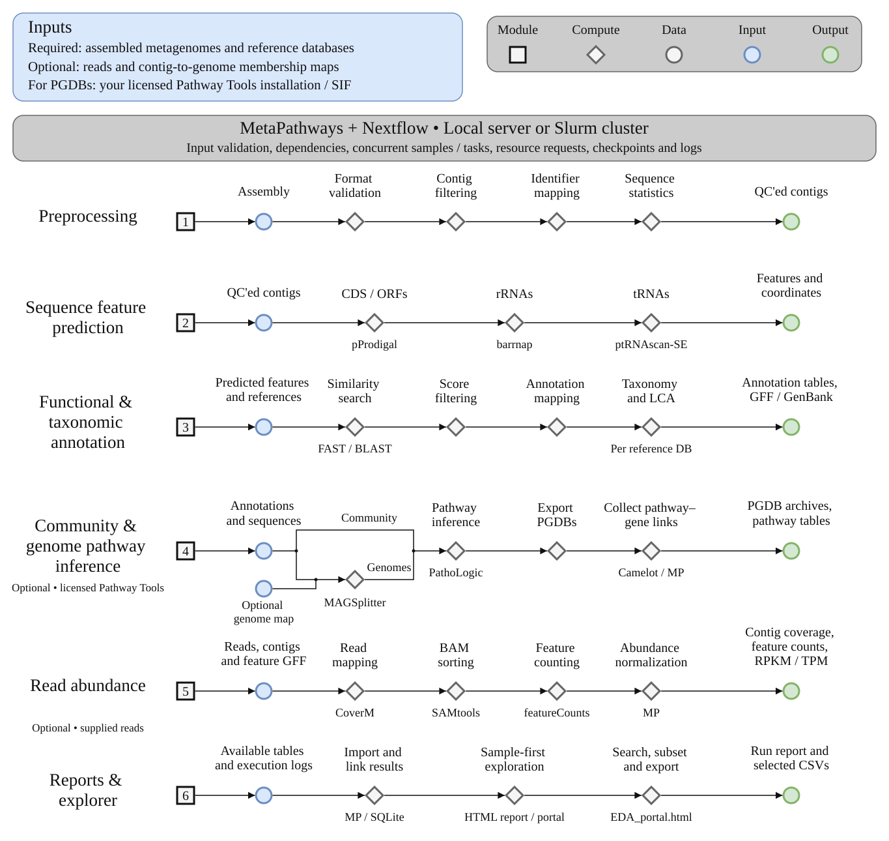

# MetaPathways

Annotate metagenomes, measure read abundance, infer community and genome pathways, and explore the results. Run on a local server or submit work through Slurm using the same commands.

**New users:** start with [installation and the three-sample test](installation.md). The small input dataset and workflow helpers are included. **Want PGDBs? Follow the [Pathway Tools installation guide](pathway-tools.md) before running the complete workflow.**

[](assets/workflow.svg)

The numbered modules summarize the biology, not the scheduler's execution order. Optional reads add abundance; genome maps add genome-specific analysis. The report and explorer connect available results for searching, subsetting and CSV export. [View the SVG](assets/workflow.svg) · [Detailed workflow and citations](detailed-workflow.md).

## Start simple

```{toctree}
:maxdepth: 1
:caption: Getting started

overview
installation
getting-started
containers
reviewer-test
reviewer-bundle
cami-references
```

## Run your analysis

```{toctree}
:maxdepth: 1
:caption: Analysis guides

inputs
databases
pathway-tools
analysis
annotation
pgdb-workflow
commands
resources
execution
troubleshooting
```

## Understand and explore

```{toctree}
:maxdepth: 1
:caption: Results and reference

reports-tutorial
reports-reference
results-schema
architecture
data-flow
detailed-workflow
workflow
cli-reference
benchmarking
reproducibility
```

## Maintain and contribute

```{toctree}
:maxdepth: 1
:caption: Development

pr-testing
releasing
release-readiness
documentation
```

Source code and documentation: [GitHub](https://github.com/hallamlab/MetaPathways). Questions, bugs and feature requests: [GitHub issues](https://github.com/hallamlab/MetaPathways/issues). See the [README](https://github.com/hallamlab/MetaPathways#team-support-and-citation) for contributors and citation.
