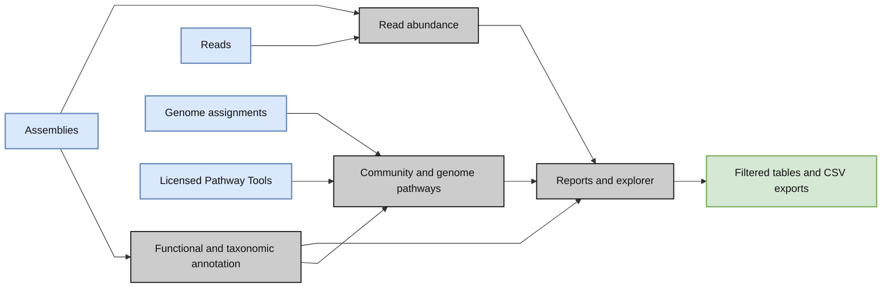

# What MetaPathways does

For the tool-by-tool diagrams and citations, see the [detailed workflow](detailed-workflow.md).

The [main workflow figure](index.md) and the diagrams below share the appnote's gray modules, blue inputs, green outputs and serif typography. Diamonds denote compute steps, not decisions; the schema diagram retains its relationship notation.

MetaPathways connects assembly annotations, read abundance and optional pathway inference in a shared set of sample and genome results. It accepts one sample or a collection and runs locally or through Slurm.

Assemblies are required. Reads add abundance measurements; genome assignments let MP split community annotations into genome-specific inputs. MP does not assemble reads or perform genome binning. Reports remain available when optional inputs are omitted.

**For PGDBs, complete the [Pathway Tools installation guide](pathway-tools.md) first.** Use `--skip_ptools` to run without pathway inference. The [data-flow diagram](data-flow.md) shows these dependencies in more detail.

Start with [installation and the included three-sample test](installation.md), then follow the [complete workflow](analysis.md).
