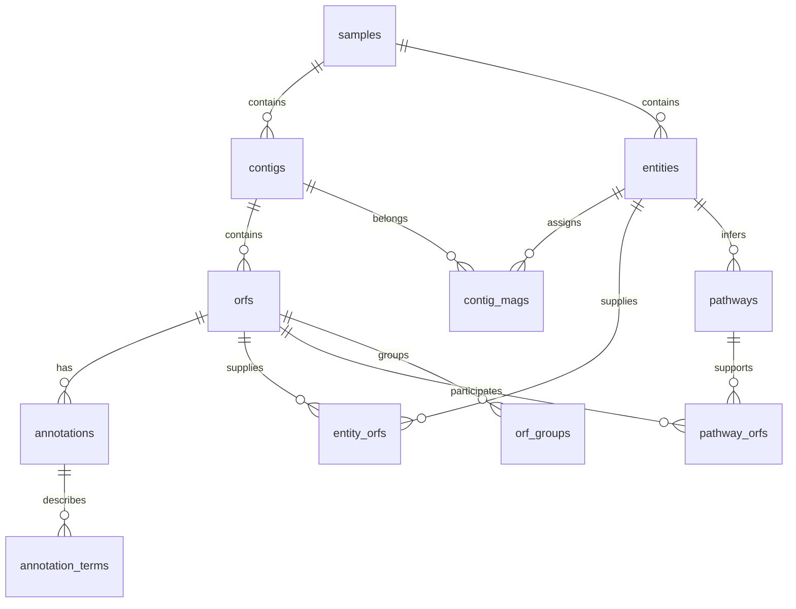

# Results schema and EDA portal

[User guide](../README.md#reports-and-the-eda-portal) · [CLI reference](cli-reference.md)

For step-by-step browsing and SSH setup, start with the [explorer tutorial](reports-tutorial.md). This page defines the exact table meanings and relationships.

## What the report does

`metapathways report -o OUTPUT` reads existing outputs and writes `OUTPUT/reports/`. It never launches annotation, read mapping, MAG splitting or Pathway Tools. Successful analysis commands also refresh the report. The report follows ASPIRE/BASINS' accounting-and-navigation approach: sample inventory, available products, import limitations, source records and links to execution diagnostics. It adds no biological interpretation or new plots.

The HTML report is readable directly from disk. The EDA portal's queries and CSV exports require `metapathways report -o OUTPUT --serve --no-rebuild`. A loopback-only server reads `results.sqlite`; the browser receives one page at a time. HTML, CSS and JavaScript are packaged with MP. There are no CDN dependencies or third-party requests.

The schema version is recorded in `schema.json`, together with generation time, source root, table/view columns, row counts, primary keys and foreign keys. SQLite is also usable from Python, R or the `sqlite3` CLI. All paths in the inventory and source tables are relative to the selected output root.

## Relationships



Always scope contig and ORF identifiers by `sample_id`. Scope a pathway by `(sample_id, entity_id, pathway_id)`: the same pathway in a community and a MAG is two inference records. `community` is the reserved community entity identifier. MAG identifiers come from output directories or the preserved contig map. As in MAGSplitter, periods in original MAG names become underscores in entity IDs; `contig_mags.original_mag_id` retains the supplied identifier. Sources use database-local integer `source_id` values; these IDs may change on rebuild and are not global identifiers.

## Tables and their row units

| Table | One row represents | Main keys and provenance |
| --- | --- | --- |
| `samples` | A sample output directory | `sample_id`; output path relative to the report root |
| `contigs` | A retained contig | `(sample_id, contig_id)`; original ID and length from `preprocessed/*.mapping.txt` |
| `orfs` | An ORF | `(sample_id, orf_id)`; contig, coordinates, strand, primary target/product and taxonomy from `*.functional_and_taxonomic_table.txt` |
| `annotations` | One reference annotation record | `annotation_id`; sample/ORF, database, accession, product, score, original EC/reaction strings, `source_id` |
| `annotation_terms` | One term on one annotation | `(annotation_id, term_type, term)`; pipe-separated EC/reaction values are split without creating EC×reaction combinations |
| `entities` | A community, MAG or unbinned entity | `(sample_id, entity_id)`; type, pathway output availability, latest recorded Pathway Tools task status |
| `contig_mags` | An explicit contig-to-MAG assignment | `(sample_id, contig_id, entity_id)`; source is preserved `magsplitter/contig_to_mag.tsv` |
| `entity_orfs` | A gene explicitly present in a MAG Pathway Tools input | `(sample_id, entity_id, orf_id)` from `magsplitter/results/*/0.pf`; **not full MAG gene membership** |
| `orf_groups` | A representative/member association | `(sample_id, representative_orf_id, member_orf_id)` from `ptools/orf_map.txt`; includes the representative itself |
| `pathways` | An entity-specific pathway inference | Composite pathway key; common name, reported score/reaction counts/ORF count and source |
| `pathway_orfs` | An explicitly reported pathway/ORF association | Composite pathway key plus `orf_id`; duplicates in an ORF list are collapsed |
| `abundance` | One original measurement for one feature | `(sample_id, feature_type, feature_id, measurement)`; numeric value and source |
| `execution` | A retained task invocation | Run identifier, command, label, outcome, duration, error and summary file; contains reruns/cache hits too |
| `sources` | A parsed source file | Relative path, size, SHA-256 and role |
| `files` | An inventoried output file | Relative path, size and modification time; large raw files are not all checksummed |
| `issues` | An import limitation or discrepancy | Sample, source and explanation |

The primary annotations and the EC/reaction mapping have different meanings. The primary table contains MP's selected target/product and reported taxonomy. `annotations` retains individual database records. It uses `*.EC_RXN_map.tsv` when available, otherwise `*.1.txt`; importing both would duplicate hits. Blank repeated ORF cells in the compact `.1.txt` format are forward-filled within that file.

ORF lengths and coordinates are copied in their source units/conventions; the importer does not recompute them. Taxonomy strings remain as reported, rather than being converted into assumed ranks. Reference scores are not relabeled as universal confidence probabilities.

Abundance retains the original measurement names, including read-file labels in CoverM's contig table. ORF `Count`, `RPKM` and `TPM` are separate measurements. The `(feature_type, sample_id, feature_id)` relation identifies a contig or ORF; SQLite cannot express this polymorphic relation as one ordinary foreign key. Abundance values are not recalculated, and historical incorrect mate mapping is not repaired by importing it.

## Ready-made explorer views

| Portal table / SQL view | Grain and joins |
| --- | --- |
| ORFs and taxonomy / `orf_explorer` | One ORF with original contig ID and length |
| Functional annotations / `annotation_explorer` | One reference annotation with contig and taxonomy |
| Pathways / `pathway_explorer` | One pathway inference with entity type and count of distinct explicit ORF links |
| Pathway genes / `pathway_gene_explorer` | One pathway/ORF link with primary product, taxonomy and contig |
| MAG ORFs / `mag_orf_explorer` | All reported ORFs on explicitly mapped contigs; requires the full contig map |
| MAG input genes / `mag_gene_explorer` | Only the selected genes in MAG Pathway Tools input files |

These views do not join all annotation hits onto all pathway memberships. Such a join creates a many-to-many expansion and makes naive counts or abundance sums wrong. The browser's related filters use `EXISTS` to select matching ORFs/annotations without multiplying rows. EC, reaction and reference-database restrictions in one related filter must match the same annotation record; pathway and entity restrictions must match the same pathway association.

An entity-only related filter selects the explicit MAG Pathway Tools input genes. For complete MAG membership, open **MAG ORFs** and filter `entity_id`; then follow the ORF's annotation/pathway links. This distinction is deliberate when old results lack the full contig map.

## Subsetting examples

### Taxon and function

1. Choose **Functional annotations**.
2. Add `taxonomy contains Bacteria` and `product contains kinase`.
3. Add `reference_db equals swissprot` if only that database is desired.
4. Select columns, click **Apply filters**, then export CSV.

### Genes supporting a pathway in one MAG

1. Choose **Pathways** and filter `sample_id`, `entity_id` and `pathway_id` by exact equality.
2. Click **Pathway genes** on that row. All three identifiers carry into the next query.
3. Filter further by taxonomy or product, and export the matching associations.
4. Use **ORF annotations** to see the gene's individual reference hits and EC/reaction terms.

### All reported ORFs assigned to a MAG

Choose **MAG ORFs** and set exact sample and entity filters. This uses the contig membership map, including ORFs absent from the selected Pathway Tools input. If the map was not preserved in old outputs, the report leaves this table empty rather than inferring membership from pathway genes. You can supply the original headerless two-column map as `SAMPLE/magsplitter/contig_to_mag.tsv` and rebuild, without rerunning biological analyses.

### SQL with explicit joins

```python
import sqlite3
from pathlib import Path

uri = Path('results/reports/results.sqlite').resolve().as_uri() + '?mode=ro'
with sqlite3.connect(uri, uri=True) as db:
    rows = db.execute('''
        SELECT g.sample_id, g.entity_id, g.pathway_id,
               g.orf_id, o.contig_id, o.taxonomy
        FROM pathway_orfs AS g
        JOIN orfs AS o USING (sample_id, orf_id)
        WHERE g.sample_id = ? AND g.entity_id = ? AND g.pathway_id = ?
    ''', ('sample', 'MAG_001', 'PWY-6167')).fetchall()
```

To count genes use `COUNT(DISTINCT orf_id)` **within a sample**, or distinct `(sample_id, orf_id)` pairs across samples. A gene participating in several pathways remains one gene. Pathway-associated ORFs are not automatically expanded through `orf_groups`: expanding a representative across MAG boundaries without checking membership would invent associations.

## Missing, partial and historical outputs

- Missing source tables produce import notes and empty/partially populated views. Referenced ORFs absent from the primary table are retained with `annotation_present=0` and null unknown fields.
- `pathway_status=available` means a pathway TSV exists, including a valid empty table. `unavailable` means no recognized pathway TSV was found. `last_task_status` records the latest retained Pathway Tools task outcome when known; an old output file can coexist with a failed latest attempt.
- Failed MAG inference is optional in MP, but not converted into a confident biological absence. Historical outputs without Nextflow summaries have unknown task status.
- The reported pathway ORF count is preserved separately from the count of unique parsed links. Disagreement is recorded in `issues`.
- Contig assignments missing from the retained contig map are counted in import notes; QC can remove original contigs.
- Malformed recognized tables or duplicate primary keys abort a rebuild. The prior database is retained. Input files are never edited by reporting.
- Reports are snapshots. `--no-rebuild` deliberately shows the old snapshot even if files have changed since generation. Rebuild when you want updated data.

## Outputs that stay as source files

The file inventory links RNA tables, FASTA/GFF/GenBank files, alignment results, run statistics, Pathway Tools flat files/archives and redundant annotation/pathway exports. Their arbitrary formats are not silently normalized into the biological core schema. The canonical pathway associations come from `*_pwy.tsv`; the denormalized `*_pwy2orf.tsv` remains accessible as its original file.

The inventory omits hidden runtime state, report products, symlinked files/directories, and standard work/cache directories. The source importer rejects resolved paths outside the selected output tree. Report generation parses result tables and hashes its indexed source files; it does not read large sequence/aligner files merely to checksum every byte.

## Exports and local service

CSV export streams every matching row with the selected columns, independent of the visible page. Null values are blank. Text that would look like a spreadsheet formula is prefixed with an apostrophe; original values remain unchanged in SQLite. A query-definition JSON records filters, columns, ordering, schema version and report timestamp. The URL hash also records the query and is bookmarkable while the corresponding report snapshot remains available.

The server binds only to `127.0.0.1`, uses a random URL prefix, checks Host/Origin, opens SQLite read-only and accepts only declared views/columns/operators. It does not execute arbitrary submitted SQL. Source-file links are restricted to the report tree and inventoried output paths. Do not expose it as a public web service. For a remote workstation, copy the results or use your site's approved SSH forwarding of a chosen loopback port.
