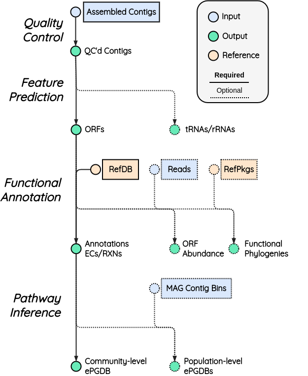

Overview 
********

MetaPathways [1]_ is a meta'omic analysis pipeline for the annotation and analysis for environmental sequence information.
MetaPathways include metagenomic or metatranscriptomic sequence data in one of several file formats 
(nucleotide FASTA or amino-acid FASTA). The pipeline consists of five operational stages including

Pipeline
~~~~~~~~

   
MetaPathways is composed of four general stages, encompassing a number of analytical or data handling steps **(Figure 1)**:

.. |nbsp| unicode:: 0xA0 
   :trim:

|nbsp|
    
#. **Quality Control**: 
   Basic quality control (QC) is performed with includes filtering out sequences below a set
   length threshold (default 180bp).
    
#. **Feature Prediction**:
   Several sequence features can be predicted on the QC'ed contigs. Open-reading frames
   (ORFs) are predicted by default and (optionally) ribosomal subunits (rRNAs) and
   transfer RNAs (tRNAs) can be predicted. To improve the runtime and efficiency, Prodigal
   [2]_ is run through a parallel version (pProdigal) [3]_ and
   tRNAscan-SE [4]_ is run using a wrapper script that allows for more
   efficient multi-threading. BARRNAP [5]_ is used for the prediction of rRNAs
   including: 16S, 23S, and 5S. MetaPathways provides an overlap-aware identification so
   that users can make informed decisions about features when they overlap each other.
   Additionally, users can define the minimum length of ORFs to keep for downstream analysis.
   
#. **Functional Annotation**:
   Using a seed-and-extend homology search algorithm, either BLAST [6]_ or FAST [7]_,
   users can conduct searches against both functional and taxonomic (optional) databases. 
   Currently supported databases include: Uniprot SwissProt [8]_, Uniprot UniRef90
   [9]_, MetaCyc [10]_, CAZymes [11]_ for functional annotations, and SILVA [12]_ for 
   taxonomic. However, users can create custom databases for any preferred databases. 
   Optionally, reads can be used to calculate abundance information at both the contig 
   and ORF-level.
      
#. **Pathway Inference**:
   MetaPathways then predicts `MetaCyc pathways <http://www.metacyc.com>`_ using the
   `Pathway Tools software <http://brg.ai.sri.com/ptools/>`_ and its pathway prediction
   algorithm PathoLogic [13]_, resulting in the creation of a community-level environmental
   Pathway/Genome Database (ePGDB), an integrative data structure of sequences, genes, pathways,
   and literature annotations for integrative interpretation. Optionally, if metagenome-assembled
   genomes (MAGs) are available for the metagenome, these MAGs can be used to create
   population-level ePGDBs. MetaCyc pathways are exported in a tabular format for
   downstream analysis.

Bibliography
~~~~~~~~~~~~

Please see the following `Zotero Library <https://www.zotero.org/groups/5284390/bcb2/library>`_ for a bibliography.

.. [1] K. M. Konwar, N. W. Hanson, A. P. Pagé, S. J. Hallam, MetaPathways: a modular 
       pipeline for constructing pathway/genome databases from environmental sequence information. 
       BMC Bioinformatics 14, 202 (2013)  http://www.biomedcentral.com/1471-2105/14/202

.. [2] D. Hyatt, P. F. LoCascio, L. J. Hauser, and E. C. Uberbacher. Gene and
      translation initiation site prediction in metagenomic sequences. Bioinformatics, 28(17):2223–2230, 2012.

.. [3] S. Jaenicke. PProdigal: Parallelized gene prediction based on Prodigal.
      https://github.com/sjaenick/pprodigal, Dec. 2023. original-date: 2019-08-10T10:51:03Z.

.. [4] P. P. Chan and T. M. Lowe. tRNAscan-SE: Searching for tRNA genes
      in genomic sequences. Methods in molecular biology (Clifton, N.J.), 1962:1–14, 2019.

.. [5] T. Seemann. Barrnap: BAsic Rapid Ribosomal RNA Predictor. 
      https://github.com/tseemann/barrnap, Dec. 2023. original-date: 2013-08-03T08:25:45Z.

.. [6] Z. Zhang, W. Miller, and D. J. Lipman. Gapped BLAST and PSIBLAST: a new 
      generation of protein database search programs. Nucleic Acids Research, 25(0):17, 1997.
      
.. [7]  D. Kim, A. S. Hahn, N. W. Hanson, K. M. Konwar, and S. J. Hallam.
      FAST: Fast annotation with synchronized threads. In 2016 IEEE Conference on Computational 
      Intelligence in Bioinformatics and Computational Biology (CIBCB), pages 1–8, 2016.

.. [8] Boutet, Emmanuel, Damien Lieberherr, Michael Tognolli, Michel Schneider, 
      and Amos Bairoch. "UniProtKB/Swiss-Prot: the manually annotated section of the UniProt 
      KnowledgeBase." In Plant bioinformatics: methods and protocols, pp. 89-112. Totowa, NJ: 
      Humana Press, 2007.

.. [9] Suzek, B.E., Wang, Y., Huang, H., McGarvey, P.B., Wu, C.H. and UniProt Consortium, 
      2015. UniRef clusters: a comprehensive and scalable alternative for improving sequence 
      similarity searches. Bioinformatics, 31(6), pp.926-932.
   
.. [10] Caspi, R., Altman, T., Billington, R., Dreher, K., Foerster, H., Fulcher, C.A., 
      Holland, T.A., Keseler, I.M., Kothari, A., Kubo, A. and Krummenacker, M., 2014. The MetaCyc 
      database of metabolic pathways and enzymes and the BioCyc collection of Pathway/Genome 
      Databases. Nucleic acids research, 42(D1), pp.D459-D471.
   
.. [11] Garron, M.L. and Henrissat, B., 2019. The continuing expansion of CAZymes and their 
      families. Current opinion in chemical biology, 53, pp.82-87.
   
.. [12] Pruesse, E., Quast, C., Knittel, K., Fuchs, B.M., Ludwig, W., Peplies, J. and Glöckner, 
      F.O., 2007. SILVA: a comprehensive online resource for quality checked and aligned ribosomal
      RNA sequence data compatible with ARB. Nucleic acids research, 35(21), pp.7188-7196.

.. [13] P. D. Karp, M. Latendresse, R. Caspi, The pathway tools pathway prediction algorithm.
      Stand Genomic Sci 5, 424–429 (2011).

